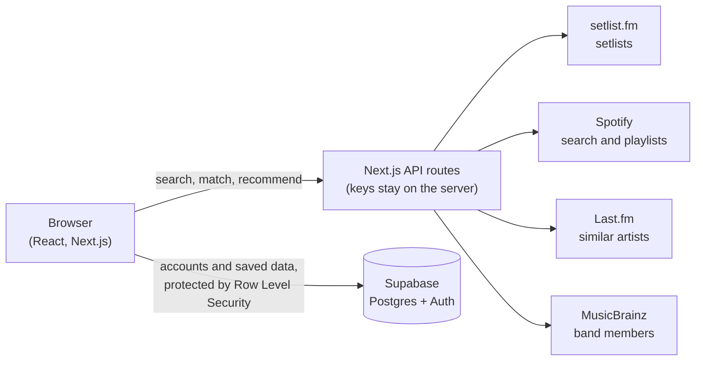

# Encore

**Every song you've heard live: counted, ranked, and turned into a Spotify playlist.**

**Live site: [encorefm.vercel.app](https://encorefm.vercel.app)**

Pick the concerts you've been to, and Encore pulls each show's setlist, counts how many times you've heard every song, lets you rank them in an S–D tier list, recommends artists you might love, and builds a Spotify playlist of everything you've heard live.

## Features

- **Concert search** across setlist.fm's crowd-sourced setlists, filtered by year, city, and country, with results as you type
- **Song counts**: every song you've heard live, from most to least heard, with medleys split into their individual songs
- **Missing songs**: add songs a setlist missed (like a tour's daily secret song), and see what other Encore users at the same show added
- **Tier lists**: drag-and-drop S/A/B/C/D rankings for songs heard live, plus custom lists built from any artist's discography or albums
- **Spotify playlists**: automatic song matching with a review screen to change, skip, or search for any match, then a playlist in your Spotify account
- **Discover**: artist recommendations based on your rankings and the shows you've seen, with a reason for each
- **Accounts**: email sign-up with confirmation, password reset, and your data saved across devices (or in the browser, as a guest)
- **Light and dark mode**, and a layout built for phones

| Review your matches | The finished playlist |
| --- | --- |
|  |  |

| Tier list | Discover |
| --- | --- |
|  |  |

## How it works

- The browser never sees an API key: every request to setlist.fm, Spotify, Last.fm, and MusicBrainz goes through Encore's own API routes
- The browser talks to the database directly, which is safe because Postgres Row Level Security limits every request to the logged-in user's own rows
- Spotify login uses the OAuth authorization code flow, with tokens in httpOnly cookies and automatic refresh

## Interesting problems

### Matching live songs to Spotify tracks

A setlist entry like "Creep" has to become one exact Spotify track. Each song is searched up to three ways (title and artist, the original artist for covers, then a loose search), and every result is scored: matching title, matching artist, and a penalty for live, remix, or karaoke versions. Scores of 70+ are accepted automatically; anything else goes to a review screen. Temporary Spotify errors are retried with exponential backoff, and one failure never stops the rest. Confirmed matches are shared: once two users agree on a track, everyone gets it without searching.

**Result: 100% of songs matched automatically across my concerts (59 of 59)**, up from 95% before the medley fixes below.

### Finding problems by measuring them

The few songs that failed to match were all **medleys**: setlist.fm lists songs played back-to-back as one entry ("It Will Rain / Talking to the Moon"). Splitting them fixed most, but one was a medley of four *covers*, searched under the wrong artist. setlist.fm stores those original artists only in a free-text note, so Encore parses it and pairs each artist with its song, only when the counts line up. Artist names are compared leniently, since setlist.fm and Spotify spell some differently ("BlueNotes" vs. "Blue Notes").

### A drag-and-drop feedback loop

Dragging songs between tiers quickly crashed the page with "Maximum update depth exceeded." Moving a song changed the tiers' sizes, which shifted the layout under the pointer, which moved the song again, forever. The fix freezes the drop target for one animation frame after each move, until the layout settles.

### Crowdsourcing without exposing anyone

Shared matches and shared song additions need everyone's data, but nobody should be able to see which concerts someone else attended. Each user can only read their own rows (Row Level Security), and `security definer` Postgres functions return only totals. They pick winners with SQL window functions and treat ties as "no answer." These were tested against an in-memory Postgres (PGlite) before shipping, including guests: a guest's user ID is `null`, and comparing `null` with `<>` would hide every result, so the function uses `is distinct from`.

### Recommendations

Each artist you know gets a score from explicit signals (tier rankings: S = 5 down to D = 1) and implicit ones (shows attended). Similar artists from Last.fm are scored by the sum of (your artist's score × similarity), so artists similar to several favorites rise to the top. MusicBrainz data then removes band members' solo projects (including other performing names, like a member's solo alias), collaboration credits that include artists you know, and members of a recommended band, for a more varied list. Every recommendation explains itself, and a hold-out test checks that hiding a favorite artist gets it recommended back.

### Working within rate limits

setlist.fm allows 1,440 requests a day for the whole app, and MusicBrainz 1 per second. Searches wait for a pause in typing and cancel outdated requests, identical searches are cached for an hour, and MusicBrainz lookups run through a rate limiter with a time budget and a week-long cache, so the slow part only happens once per artist.

## Tech stack

- **Frontend**: Next.js 16 (App Router), React, TypeScript, CSS with design tokens, dnd-kit for drag and drop
- **Backend**: Next.js API routes, Supabase (Postgres, Auth, Row Level Security)
- **APIs**: setlist.fm, Spotify Web API, Last.fm, MusicBrainz
- **Testing and CI**: Vitest (76 tests on the core logic, including regression tests for real bugs), GitHub Actions running lint, type checking, and tests on every push
- **Database workflow**: versioned migrations and generated TypeScript types with the Supabase CLI, with separate development and production projects
- **Hosting**: Vercel

## Running it locally

1. Clone the repository and install dependencies: `npm install`
2. Copy `.env.local.example` to `.env.local`, and fill in keys for setlist.fm, Spotify, Last.fm, and a Supabase project
3. Set up the database: `npx supabase login`, `npx supabase link --project-ref <your-ref>`, then `npm run db:push`
4. Run `npm run dev` and open `http://127.0.0.1:3000` (Spotify only accepts `127.0.0.1` for local logins)

Useful scripts: `npm test`, `npm run typecheck`, `npm run lint`, `npm run db:new <name>`, `npm run db:types`

## Known limitations

- **Spotify features are invite-only.** Spotify's development mode allows up to 5 invited accounts; extended access requires an organization with a large user base. Everything else in Encore works for everyone
- **The free database pauses** after about a week without activity
- **Collaborative filtering** ("people who saw the same shows also saw...") needs more users to be useful, so recommendations are content-based for now
- **The UI isn't covered by automated tests yet**; the tests focus on the core logic

## What's next

- An AI agent that investigates songs matching can't find (renamed songs, typos), and finds unlisted surprise songs from what fans post online, with every suggestion confirmed by the user

## How it was built

Built with AI-assisted development: I designed the product, made the technical decisions, tested it with real data, and found and directed the fixes for its bugs. I can walk through any part of the code. [`docs/GUIDE.md`](docs/GUIDE.md) documents every step and decision along the way.

## Credits

Setlist data from [setlist.fm](https://www.setlist.fm). Similar-artist data from [Last.fm](https://www.last.fm). Artist relationships from [MusicBrainz](https://musicbrainz.org). Music data and playlists via [Spotify](https://www.spotify.com).
